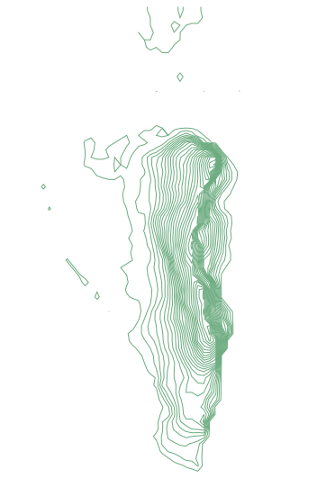

# Get elevation data

For most geodata, I go to OpenStreetMap. But there is one type of data you do not get there: elevation data. This tutorial will show you how to get that.

## Where does it come from?

**SRTM**

From the [wikipedia article](https://en.wikipedia.org/wiki/Shuttle_Radar_Topography_Mission)

> *The Shuttle Radar Topography Mission (SRTM) is an international research effort that obtained digital elevation models on a near-global scale from 56° S to 60° N.*
> (...)
> *The elevation models are arranged into tiles, each covering one degree of latitude and one degree of longitude, named according to their south western corners.*
> (...)
> *They can be downloaded freely over the Internet, and their file format (.hgt) is widely supported.*

After a quick internet search I found somewhere to get said ```.hgt``` files: [viewfinderpanorama.org](http://www.viewfinderpanoramas.org/Coverage%20map%20viewfinderpanoramas_org3.htm). I am sure there are other sources but this is what we are looking for.

## Get the data

As an example I will get the rock of Gibraltar with the following bounding box:

```
{
	minLongitude: -5.376434,
	minLatitude: 36.10626,
	maxLongitude: -5.324249,
	maxLatitude: 36.160885
}
```

The tile we are looking for is N36W006.hgt.

## Convert the data

I tried opening the file in a text editor. Turns out it is not in a human readable format. But there is a package that reads most geodata, [GDAL](http://www.gdal.org/). If you do GIS on your computer, chances are you already have it installed as it comes as a dependency to a lot of mapping software.

### GDAL

Check if you have it by opening a terminal window:

```
$ ogrinfo
```

If you get something like below, you have it.

```
Usage: ogrinfo [--help-general] [-ro] [-q] [-where restricted_where]
               [-spat xmin ymin xmax ymax] [-geomfield field] [-fid fid]
               [-sql statement] [-dialect sql_dialect] [-al] [-so] [-fields={YES/NO}]
               [-geom={YES/NO/SUMMARY}][--formats]
               datasource_name [layer [layer ...]]

FAILURE: No datasource specified.
```

Otherwise, see install instructions [here](http://trac.osgeo.org/gdal/wiki/DownloadingGdalBinaries). 

### Crop the area we want

The first step is to crop the ```.hgt``` file to the area we need with [gdalwarp](http://www.gdal.org/gdalwarp.html).

The pattern looks like this:

```
gdalwarp -te <x_min> <y_min> <x_max> <y_max> source.file destination.file
```

So for gibraltar we do:

```
gdalwarp -te -5.376434 36.10626 -5.324249 36.160885 N36W006.hgt gibraltar.hgt
```

Our bounding box fits into a single ```.hgt``` file. If it had been on several files, we would have added all source files, like this:

```
gdalwarp -te <x_min> <y_min> <x_max> <y_max> source1.file source2.file source3.file destination.file
```

### Convert to GeoTIFF

Now that we have ```gibraltar.hgt```, let's convert it to a [GeoTIFF](https://en.wikipedia.org/wiki/GeoTIFF), a georeferenced image file.

First we need to specify the color scale we want by creating a file called ```relief.clr```:

```
100% 255:255:255
0%   0:0:0
nv   0:0:0
```

This is a black and white color scale.

Then we convert it using [gdaldem](http://www.gdal.org/gdaldem.html):

```
gdaldem color-relief -of GTiff gibraltar.hgt relief.clr gibraltar.tiff
```

We get a picture that looks like this:


### Convert to vector data

We have a raster file but want to convert it to a vector format. We will use [gdal_contour](http://www.gdal.org/gdal_contour.html) specifing the following options:

* ```-i``` the height interval in meters.
* ```-snodata``` what to do with void pixels (see the explanation [here](http://wiki.openstreetmap.org/wiki/Contours#The_shapefiles_approach))
* ```-f``` the output format (defaults to shapefile)
* ```-a``` the name of the elevation property

The command looks like this:

```
gdal_contour -i 10 -snodata 32767 -f "GeoJSON" -a height gibraltar.tiff gibraltar.json
```

We have a GeoJSON file (a human readable vector data format) called ```gibraltar.json```.



